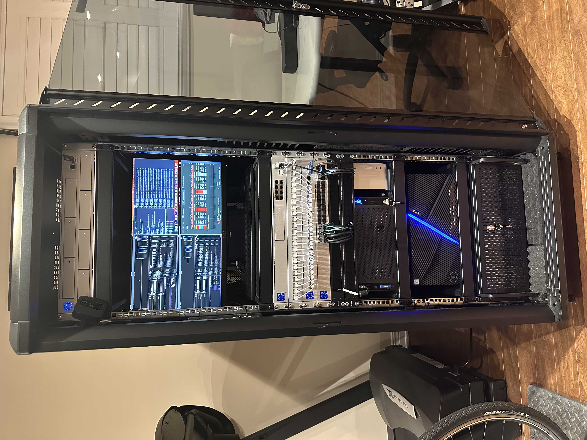
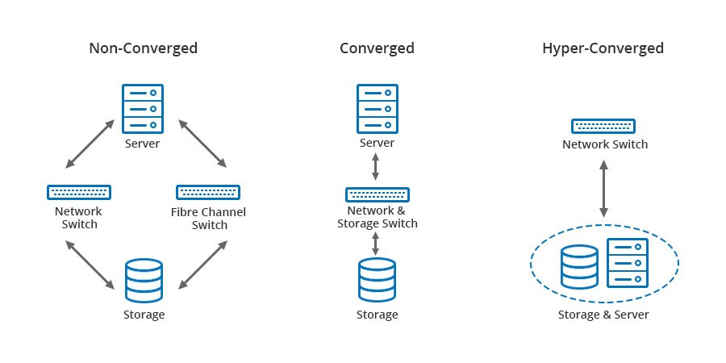

# 從零開始搭建家庭高可用超融合數據中心

故事從去年開始，因為越來越多的數據存儲和 AI 計算需求，我開始重新組織家裏的計算資源，把零散的計算資源整合成更便於管理和維護的統一資源架構。陸陸續續折騰了一段時間，在這個過程中，我遇到了很多的問題，之前也在 X 上也和大家分享過一些，大家建議我都寫下來，經過一些考慮，我決定成體系地介紹一下如何一步一步搭建適合家庭網絡規模的`高可用超融合數據中心`。



當然了，說`數據中心`是一個誇大的概念，但是這個過程的確已經覆蓋了搭建一個小型數據中心所需要的常見類別的設備和比較完整的步驟。本文會有一些設備選型上的考慮，也會有很多配置上的細節，不一定很有含金量，但求給大家一些參考。事實上，玩`homelab`並非一定要很 fancy 的硬件，設備選擇上豐儉由人，通過合理的配置和組合，只要樂意折騰，都可以學到很多，並且組合出適合自己的工作環境。我將會從網絡搭建開始，講到存儲，再到虛擬化，因為我覺得考慮 homelab 的配置，應該遵循這一個順序，避免來回折騰，浪費時間。

## 什麼是超融合

關於數據中心如何從`傳統架構`演進到`融合架構`再到`超融合架構`，可以簡單過一下[這個視頻](https://www.youtube.com/watch?v=xZvLvKv1rjs)。簡單來說，在傳統的數據中心，服務器節點一般分為三大類別，網絡服務器，存儲服務器，應用服務器：

- 網絡服務器包括光電線路的路由器，防火牆，交換機，IoT 網關等等；
- 存儲服務器往往以集群的方式存在，對應用服務器提供冷熱數據的訪問，二進制數據和結構化數據的存儲、備份等等，有多方式實施，如 NAS，SAN，DAS 等型態；
- 應用服務器承擔著要的計算任務，包括 CPU 為主的運算以及新興的 GPU 為主的運算，提供的服務包括 Web 服務，郵件服務，虛擬機，容器集群，密集計算服務等等。



超融合[HCI (Hyper-Converged Infrastructure)](https://en.wikipedia.org/wiki/Hyper-converged_infrastructure)的概念比較新，它是隨著虛擬化的發展而提出來的一重新`組織服務器資源的策略`，也是所謂`軟件定義數據中心`的核心概念之一。超融合數據中心將網絡（部分），存儲，運算三種資源融合在一起，形成一個統一的資源池，完全由虛擬化平台提供各種計算和存儲資源。

在一個超融合計算中心裡面，除了物理主機的網絡連接需要單獨的網絡設備之外，其他的資源都可以通過虛擬化平台來提供，每個物理主機都是全能節點，承擔部分的計算和存儲，他們之間`緊密相連`，`資源共享`，`相互備援`。超融合不是一個特定的單一軟件技術，它其實脫胎於虛擬化、分佈式存儲等一系列技術上的概念。在實施上，常見的超融技術棧有 [PVE (Proxmox VE)](https://www.proxmox.com/en/proxmox-ve) + [Ceph](https://ceph.io), [VMware vSphere](https://www.vmware.com/products/cloud-infrastructure/vsphere), [Hyper-V](https://learn.microsoft.com/en-us/windows-server/virtualization/hyper-v/hyper-v-overview) + [S2D](https://learn.microsoft.com/en-us/system-center/vmm/s2d-hyper-converged?view=sc-vmm-2025&tabs=HyperVhosts) 等等。本文以 PVE + Ceph 為例子，其他方案的包裝可能有差異，但是原理是相通的。

## 從機櫃開始

接下來我會介紹一些我選用的硬件，沒有任何廣告的成分，因為 X 上很多人對我用的設備感興趣，這裡簡單介紹一下一些基礎的選型思路。

首先要有一個機櫃。選型上，除了通風設計的考慮之外，我認為首先要測量一下計畫存放的房間或者地下室的高度，在能容納的高度範圍內選擇一個最高的。高度決定了這套設備將來的擴展性，不要猶豫，越高越好。我的地下室有一根懸梁，限制了最大高度，所以只能選擇的最大 32U 的，具體是這款：[StarTech.com 4-Post 32U Server Rack Cabinet](https://www.amazon.ca/dp/B099986PZF?ref_=ppx_hzsearch_conn_dt_b_fed_asin_title_5&th=1)。

下面這個表列出了多少 Unit 的櫃子大概有多少高度，範圍從 1U 到 48U，也可以直接在[這個頁面](https://www.penn-elcom.com/ca/rack-unit-calculator)上動態估算。

| Rack Units | Height (in) | Height (ft) | Height (cm) |
|------------|------------|------------|------------|
| 1U         | 1.75″      | 0.15′      | 4.4 cm     |
| 2U         | 3.5″       | 0.29′      | 8.9 cm     |
| 3U         | 5.25″      | 0.44′      | 13.3 cm    |
| 4U         | 7″         | 0.58′      | 17.8 cm    |
| 5U         | 8.75″      | 0.73′      | 22.2 cm    |
| 6U         | 10.5″      | 0.88′      | 26.7 cm    |
| 7U         | 12.25″     | 1.02′      | 31.1 cm    |
| 8U         | 14″        | 1.17′      | 35.6 cm    |
| 9U         | 15.75″     | 1.31′      | 40 cm      |
| 10U        | 17.5″      | 1.46′      | 44.5 cm    |
| 11U        | 19.25″     | 1.6′       | 48.9 cm    |
| 12U        | 21″        | 1.75′      | 53.3 cm    |
| 13U        | 22.75″     | 1.9′       | 57.8 cm    |
| 14U        | 24.5″      | 2.04′      | 62.2 cm    |
| 15U        | 26.25″     | 2.19′      | 66.7 cm    |
| 16U        | 28″        | 2.33′      | 71.1 cm    |
| 17U        | 29.75″     | 2.48′      | 75.6 cm    |
| 18U        | 31.5″      | 2.63′      | 80 cm      |
| 19U        | 33.25″     | 2.77′      | 84.5 cm    |
| 20U        | 35″        | 2.92′      | 88.9 cm    |
| 21U        | 36.75″     | 3.06′      | 93.3 cm    |
| 22U        | 38.5″      | 3.21′      | 97.8 cm    |
| 23U        | 40.25″     | 3.35′      | 102.2 cm   |
| 24U        | 42″        | 3.5′       | 106.7 cm   |
| 25U        | 43.75″     | 3.65′      | 111.1 cm   |
| 26U        | 45.5″      | 3.79′      | 115.6 cm   |
| 27U        | 47.25″     | 3.94′      | 120 cm     |
| 28U        | 49″        | 4.08′      | 124.5 cm   |
| 29U        | 50.75″     | 4.23′      | 128.9 cm   |
| 30U        | 52.5″      | 4.38′      | 133.4 cm   |
| 31U        | 54.25″     | 4.52′      | 137.8 cm   |
| 32U        | 56″        | 4.67′      | 142.2 cm   |
| 33U        | 57.75″     | 4.81′      | 146.7 cm   |
| 34U        | 59.5″      | 4.96′      | 151.1 cm   |
| 35U        | 61.25″     | 5.1′       | 155.6 cm   |
| 36U        | 63″        | 5.25′      | 160 cm     |
| 37U        | 64.75″     | 5.4′       | 164.5 cm   |
| 38U        | 66.5″      | 5.54′      | 168.9 cm   |
| 39U        | 68.25″     | 5.69′      | 173.4 cm   |
| 40U        | 70″        | 5.83′      | 177.8 cm   |
| 41U        | 71.75″     | 5.98′      | 182.2 cm   |
| 42U        | 73.5″      | 6.13′      | 186.7 cm   |
| 43U        | 75.25″     | 6.27′      | 191.1 cm   |
| 44U        | 77″        | 6.42′      | 195.6 cm   |
| 45U        | 78.75″     | 6.56′      | 200 cm     |
| 46U        | 80.5″      | 6.71′      | 204.5 cm   |
| 47U        | 82.25″     | 6.85′      | 208.9 cm   |
| 48U        | 84″        | 7′         | 213.4 cm   |

需要注意的是，櫃子會有上蓋和底座，有一些底座下面還有輪子，所以一定要根據自己的實際需求來選擇，並且多做幾次測量避免尷尬，因為要退換的話，將會非常麻煩，一個比較正式的幾架，是相當重的。

### 機器上架

我們接下來會挑選一些設備，從網絡設備出發，但是對於後面各種類型的設備在插入機櫃之前，都需要大致考慮好機器的擺放順序，所以我們先簡單了解一下上架機器的一些基本準則：

- 重的機器往下放，主要是存儲和 UPS 等；
- 輕的機器往上放，主要是電源管理，網絡設備，輔助設備，KVM 等；
- 太熱的機器不要放在一起，要有間隔，盡可能讓熱的機器靠近風扇防止機機積熱；
- 根據自己的身高和維護習慣安排 KVM 的位置，大概率可能會被安排在機櫃的中上部分；
- 盡可能多安排風扇，保持通風，可以大大減少機器因為積熱帶來的穩定性問題，風道設計上，應該從下往上，從前往後，比較細緻的可以上自動控溫設備。

這裡引用一個比較理想情況下的[單櫃排列策略圖](https://lucid.app/lucidchart/c67227d4-dbd8-4164-9005-24aabf8a3765/view?anonId=0.07fd85c819500992984&sessionDate=2025-02-13T18%3A36%3A39.778Z&sessionId=0.e8ca132219500992985&fromMarketing=true&page=0_0#
)：


🔔 需要注意，其實每個櫃子的實際情況都是不一樣的，非一體化設計的機櫃單元，很多時候會因為線纜長度的制約，走線的需要，機器的尺寸、重量，甚至個人的喜好而有所調整，這都很常見，事實上隨著業務的變化，我也調整過幾次才達到滿意的效果。

## 網絡規劃

網絡設備的選擇上，首先要考慮的是速率上的規劃。我建議所有用戶，都從 10GE 開始考慮，低於 10GE 的設備，強烈不建議購買了。有條件的話，40GE 或者 100GE 都可以考慮。

另一點就是考慮傳統 RJ45 電口還是 SFP/SFP+/SFP28/QSFP+/QSFP28 等光模塊接口。在這個問題上，我考慮了很久，主要的原因是，我已經有一部分的設備已經是 10GE 電接口的，如果我選擇 SFP+ 路線，我將無法兼容已有的設備。但是 10G 以上電口在我之前的使用中，的確遇到一些問題，網卡載荷大，發熱高，我的確想趁機會演進到光口路線。在花了很多時間考量，最後決定都要有，事實上到目前為止，我依然覺得這是一個正確的決定，目前的網絡容量和靈活性讓我在工作中獲得了很大的彈性，並預留了足夠的性能空間。

### 我選用的設備

- 聚合交換機 [UniFi USW-Pro-Aggregation](https://ca.store.ui.com/ca/en/products/usw-pro-aggregation)
    > 正如我前面說的，我需要有足夠的電口和光口，可管理，可堆疊，可擴展，高性能，穩定可靠的交換機作為核心網的基礎。這款交換機有 32 個 28 個 10G SFP+ 接口和 4 個 25G SFP28 接口，交換容量是 760Gbps，非阻塞 IO 能到 380 Gbps，支持 VLANs 和鏈路聚合，Layer 3 和 Layer 2 都是可管理的。

- 以太網交換機[UniFi USW-EnterpriseXG-24](https://ca.store.ui.com/ca/en/products/usw-enterprisexg-24)
    > 我使用這一款交換機來兼容原有的設備，支持 Wi-Fi 熱點、遠程 KVM、智能家居等傳統電口網絡設備。它有 24 個 10G RJ45 電口和 2 個 25G SFP28 光口，交換容量是 580Gbps，非阻塞 IO 能到 290Gbps，同樣支持 VLANs， Layer 3 和 Layer 2 可管理。

- 入口路由/防火牆 [UniFi Dream Machine Special Edition (UDM-SE 180W)](https://ca.store.ui.com/ca/en/products/udm-se)
    > 這款設備有一個 10G SFP+ Uplink 作為主要入口，一個 2.5G RJ45 Uplink 作為備用網絡入口，有 1 個 10G SFP+ Downlink 和 8 個 GE RJ45 Downlink，其中 2 個電口支持 PoE+， 其餘 6 個是電口都支持 PoE。它唯一讓我不滿意的是 Uplink 只開放了 3.5Gbps，雖然我只有 3Gbps 對等光線接入，的確已經足夠，但是總覺得餘量不足，比較懊悔的是，我下單不久[Dream Machine Pro Max (UDM-Pro-Max)](https://ca.store.ui.com/ca/en/category/cloud-gateways-large-scale/products/udm-pro-max) 就上市了，它的 Uplink 能到 5 Gbps，就好不少。

### 主要網絡設備的拓撲

```
+-----------------------------------------------------------------+
|                            INTERNET                             |
+-----------------------------------------------------------------+
        |                   |                        |
+----------------+ +------------------+ +-------------------------+
| Bell Fibe (3G) | | Starlink (Bak 1) | | Nighthawk M5 5G (Bak 2) |
+----------------+ +------------------+ +-------------------------+
        |                   |                        |
       10G                2.5G                      1G
        |                   |                        |
+-----------------------------------------------------------------+
|                  Dream Machine Special Edition                  |
+-----------------------------------------------------------------+
                                |
                             10G SFP+
                                |
+-----------------------------------------------------------------+
|                       USW-Pro-Aggregation                       |
+-----------------------------------------------------------------+
                                |
                    50G LACP (25G SFP28 * 2)
                                |
+-----------------------------------------------------------------+
|                       USW-EnterpriseXG-24                       |
+-----------------------------------------------------------------+
```

## 存儲規劃

在網絡安排好之後，我建議先考慮存儲，存儲決定了這套設備能處理的數據的極限，這可能包括你工作需要存儲的數據，例如視頻工作者，AI 工程師等等往往都對存儲空間有較高的需求。對於 homelab 來說，可能還有媒體服務，遊戲串流服務，相冊服務等等一些個人數據的存放。

坦白說，在有條件的情況下，盡可能多安排存儲，會少走很多彎路。存儲池我個人建議至少安排一個 SSD 高速池用來支持虛擬化、數據庫、AI 運算等，加一個 HDD 大容量存儲池，用來存儲備份數據，非活躍項目的大體積數據等。我個人推薦存儲方案的選擇應該滿足兩個條件：穩定是大前提，靈活可伸縮相當重要，我最終的方案是：

- 高速存儲池通過 Ceph 實現，SSD + NVME，單盤 4TB * 5 盤 * 4 節點；
- 大容量存儲池通過 [Mdadm](https://docs.kernel.org/admin-guide/md.html) RAID6 實現，HDD，單盤 18T * 12 盤；

其中的 Ceph 是超融合重要的一環，後面會詳細解釋。至於大容量的存儲池為什麼選擇 Mdadm 而不是 [ZFS](https://openzfs.github.io/openzfs-docs/Getting%20Started/index.html) 或者 [LVM](https://en.wikipedia.org/wiki/Logical_Volume_Manager_(Linux))，這個主要看個人的喜好。我對穩定性和靈活性都有很高的要求，ZFS 的確很強大，但是對於陣列的伸縮性比較侷限，不能滿足我喜歡折騰的喜好。LVM 對快照的支持比較差，而且還有不少其他問題尚未解決，例如內建 RAID 的可恢復性等等。所以我還是選擇了在 Linux 上廣泛使用，穩定性同樣無可挑剔的 Mdadm，並在上面使用 [Btrfs](https://docs.kernel.org/filesystems/btrfs.html) 文件系統來支持快照和文件校驗，有意思的是，這個組合恰好是 Unifi UNAS Pro 所使用的方式。當然，這個主要看個人喜好，對擴展性，靈活性，穩定性，容災重建等每個人的理解都不一樣，選擇自己喜歡的，不要陷入神仙打架的局面。

### Ceph

重點介紹一下 [Ceph](https://ceph.io)，這是開源超融合方案的核心組件，如果你搭配 PVE 使用的話，選擇 Ceph 作為存儲池，可以獲得非常好的性能，擴展性和穩定性，同時 PVE 面板上整合的 Ceph 管理工具簡單實用，可以快速管理存儲集群的健康狀態。當然 PVE 對 Ceph 的集成雖然很好，但是 Ceph 是一套十分強大和複雜的分佈式存儲系統，很多高級操作依然需要命令行，這個無可避免，後面我會介紹一些比較常用的命令。

為什麼說 Ceph 是超融合方案的核心？其實前文已經提到，在超融合數據中心裡面，所有的資源是充分共享和網絡化的。你可以理解，業務不是運行在單一機器，或者單一個虛擬機裡，粗略又抽象地理解，服務是跑在集群上。整個集群一起來支撐每個業務，機器之間緊密相連，相互備援。在 PVE 中正確配置 Ceph 作為存儲後端之後，虛擬機是可以在集群裡面隨意遷移的，VM 可以不關機從一個主機直接遷移到另一個主機上運行，對外甚至是無感知的。這帶來了很多便利，例如一台機器故障或者需要維護重啟，你完全不用擔心上面的業務，PVE 可以自動把運行中的 VM 在線遷移到集群中其他機器上運行。這種無縫遷移依賴集群把存儲視為一個整體，從不同機器都可以訪問到一樣的數據。PVE 當然也支持通過 SAN 網絡或者 NFS 等傳統方案來實現統一存儲，但顯然 Ceph 是更面向未來的選擇。

有幾點需要注意：

- 為了獲得足夠理想的 IOPS 性能，至少一個全 SSD/NVME 存儲池是值得優先考慮的；
- 為了獲得足夠的冗余，推薦從 4 個節點起步，size 4，min 2 應該是最低安全保障，這相當於集群中每份數據保存在 4 個節點上，至少滿足 2 個節點在線時允許讀寫，2 個節點離線不影響業務。

## 安裝虛擬化平台 PVE

Proxmax VE 基於 [Debian](https://www.debian.org)，這其實也是我選擇它的原因之一。作為多年 Debian 用戶，我對於它的穩定性相當有信心。它唯一缺點是保守，stable 分支軟件包相對較舊，需要嘗新可以用其他分支，但是我認為宿主機的穩定性是最重要的，嘗新完全可以在 VM 中折騰。


事實上我推薦的安裝方式並不是直安裝 PVE，而是先安裝 Debian，然後安裝 PVE 軟件包。這個主要的原因在於，我在幾個服務器上，嘗試直接安裝 PVE 都失敗，可能是我環境的問題，也有其他朋友和我遇到相似的問題，這裡不深究，但是從 Debian 上安裝，表現更符合預期：

- [使用引導介質直接安裝 PVE](https://www.proxmox.com/en/products/proxmox-virtual-environment/get-started);
- [從 Debian 安裝 PVE](https://pve.proxmox.com/wiki/Install_Proxmox_VE_on_Debian_12_Bookworm)

PVE 官方文檔要求 Debian 版本為 12(Bookworm)，事實上大家可以放心直接在 stable 分支上運行。有一些包比 PVE 預設的更新，但是沒有任何兼容性問題。

### 簡述安裝步驟

##### 1. 安裝 Debian 12 Bookworm，切換到 stable 分支

##### 2. 在 `/etc/host` 中加入當前主機的 IP 地址

```bash
# vim /etc/host
```

```hosts
[本機本地 IP]    [當前主機名]
```

Example:

```hosts
192.168.1.64    Enlightenment
```

確保地址正確

```bash
$ hostname --ip-address
```

確保返回的地址是 `/etc/host` 中配置的地址，而不是 `127.0.0.1` 或 `::1` 等 `loopback` 地址。

##### 3. 添加 PVE 的 apt 源

```bash
# echo "deb [arch=amd64] http://download.proxmox.com/debian/pve bookworm pve-no-subscription" > /etc/apt/sources.list.d/pve-install-repo.list
```

##### 4. 添加 PVE 源的密鑰

```bash
# wget https://enterprise.proxmox.com/debian/proxmox-release-bookworm.gpg -O /etc/apt/trusted.gpg.d/proxmox-release-bookworm.gpg
```

驗證密鑰（最新密鑰 hash 值請參考[官方文檔](https://pve.proxmox.com/wiki/Install_Proxmox_VE_on_Debian_12_Bookworm)）：

```bash
$ sha512sum /etc/apt/trusted.gpg.d/proxmox-release-bookworm.gpg
7da6fe34168adc6e479327ba517796d4702fa2f8b4f0a9833f5ea6e6b48f6507a6da403a274fe201595edc86a84463d50383d07f64bdde2e3658108db7d6dc87 /etc/apt/trusted.gpg.d/proxmox-release-bookworm.gpg
```

##### 5. 更新 apt 源，升級系統

```bash
# apt update && apt upgrade -y
```

##### 6. 安裝 PVE 內核

```bash
# apt install proxmox-default-kernel
# systemctl reboot
```

##### 7. 安裝 PVE 套件

```bash
# apt install proxmox-ve postfix open-iscsi chrony
```

##### 8. 刪除 Debian 默認內核

```bash
# apt remove linux-image-amd64 'linux-image-6.1*'
# update-grub
```

##### 9. 刪除 os-prober

避免虛擬機被錯誤加到引導菜單。

```bash
# apt remove os-prober
```

##### 10. 刪除企業版 apt 源，僅使用開源版組件

如果你打算購買企業版，忽略此步驟。

```bash
# rm /etc/apt/sources.list.d/pve-install-repo.list
```

##### 11. 重啟，確保可以正常引導

如果你的 Debian 是啟動到命令行的，你應該會看到 PVE 的歡迎介面，如果你是啟動到圖形介面的，你不會看到任何變化，可以執行以下命令查看 PVE 是不是已經正確安裝：

```bash
$ pveversion
```

如果看到類似以下的輸出，說明 PVE 已經正確安裝：

```
pve-manager/8.3.3/f157a38b211595d6 (running kernel: 6.11.0-1-pve)
```

注意，如果無法看到 PVE 歡迎介面，先檢查一下上面 IP 地址的步驟。

##### 12. 訪問 PVE 管理面板

PVE 管理頁面默認可以通過這個地址訪問：

```
https://[節點本地 IP 地址]:8006
```

例如：

```
https://192.168.1.64:8006
```

注意協議是`https`，瀏覽器需要忽略一下自簽證書的安全檢查。管理頁面默認可以通過系統的`root`帳戶密碼登陸，`Realm`選擇`Linux PAM standard authentication`，進入系統之後配置其他登錄驗證方式。

至此 PVE 節點已經完成了基本的安裝，下面我會開始介紹一些必須的配置項目。

### 配置網絡

你需要先配置一個網橋，便於 VM 訪問網絡，[PVE 官方文檔中有詳情](https://pve.proxmox.com/wiki/Network_Configuration)：

#### 1. 先查詢網卡設備號

```bash
$ ifconfig -a
```

識別出網口設備號，如 eno1, enp1s0 等等，紀錄下來。

#### 2. 配置網橋

編輯 `/etc/network/interfaces` 文件，根據需要添加以下內容：

```interfaces
auto lo
iface lo inet loopback

auto [網口設備號]
iface [網口設備號] manual

auto [新建網橋設備號，如 vmbr0]
iface [新建網橋設備號，如 vmbr0] inet static
        address [配置為安裝步驟中指定的 IP 地址]/24(可通過`/`配置網段，也可通過`netmask`來配置)
        netmask [子網掩碼](如果上面一行已配置網段，此處可忽略)
        gateway [配置網關地址]
        bridge-ports [網口設備號，如前所述]
        bridge-stp off
        bridge-fd 0
```

### 3. 配置鏈路聚合

如交換機支持 LACP，或有兩個以上交換機且同時連接，強烈建議配置[鏈路聚合](https://pve.proxmox.com/wiki/Network_Configuration)，你可以聚合兩個或多個網絡接口，這樣可以提高網絡的穩定性和帶寬，對集群的穩定性，特別是 Ceph 的穩定性有很大的幫助。

編輯 `/etc/network/interfaces` 文件，根據需要添加以下內容，注意由於增加了鏈路聚合層，網橋中指定的設備號要`物理網口設備號`改為`聚合設備號`：

```interfaces
auto [網口 1 設備號]
iface [網口 1 設備號] manual

auto [網口 2 設備號]
iface [網口 2 設備號] manual

[...]

auto [新建鏈路聚合設備號，如 bond0]
iface [新建鏈路聚合設備號，如 bond0] inet manual
    bond-slaves [網口 1 設備號] [網口 2 設備號] [...]
    bond-mode 802.3ad
    bond-xmit-hash-policy encap3+4
    bond-miimon 100
    bond-downdelay 200
    bond-updelay 200
    bond-lacp-rate 1

auto [新建網橋設備號，如 vmbr0]
iface [新建網橋設備號，如 vmbr0] inet static
    address [配置為安裝步驟中指定的 IP 地址]/24(可通過`/`配置網段，也可通過`netmask`來配置)
    netmask [子網掩碼](如果上面一行已配置網段，此處可忽略)
    gateway [配置網關地址]
    bridge-ports [聚合設備號，如 bond0，需和上一小節保持一致]
    bridge-stp off
    bridge-fd 0
```

#### 4. 重啟網絡以應用配置

```bash
# systemctl restart networking
```

#### 5. 開啟 [Jumbo Frame](https://en.wikipedia.org/wiki/Jumbo_frame)

Jumbo Frame 是 10GE 對於高速網絡至關重要，更大的包可以減少包的數量，降低 CPU 在封包和解包過程的負擔，顯著提升網絡的吞吐量。對於 Ceph 來說，Jumbo Frame 至關重要。

配置主要網絡設備的 MTU 為 9000，根據前面的配置填入合適的`設備號`，例如 `vmbr0`(無聚合) 或 `bond0`(有聚合)：

```bash
# /usr/bin/ip link set [設備號] mtu 9000
```

你可把類似的配置放在`/etc/network/interfaces`中，也可直接把上面的命令放在`/etc/crontab`中，通過`@reboot`和`sleep`(等待網絡初始化完成)來執行，完全是個人喜好，此處不作贅述。

注意！請保證每個節點使用相同的 MTU 封包尺寸，這將是集群穩定性的關鍵，如果 MTU 不一致，PVE 集群會出現不穩定，節點掉線等情況。對於 Ceph 尤其如此，不一致的 MTU 會導致 OSD 心跳受阻，進而導致 OSD 頻繁從集群中離線。我有一個節點出現這個情況花了很長時間才解決。

#### 6. 測速，確保速度符合預期

為了方便調試，我建議所有節點開啟 iperf3 服務，這樣可以大大方便節點間的的網絡調試。

```bash
# apt install iperf3
```

從 A 節點測試到 B 節點的網絡速度：

```bash
# iperf3 -c [B 節點 IP 地址] -P [線程數]
```

其中`-P`參數可以指定測試的線程數，默認是 1 個線程。如果需要測試多個線程的話，例如測試 LACP 的效果，可以指定多個線程，例如`-P 10`表示使用 10 個線程進行測試。

### 配置顯卡直通

如有 AI 運算、遊戲或視頻剪輯需求，顯卡直通必不可少，這裡面網上有很多的介紹，有對有錯，這裡簡單總結一下步驟：

#### 1. 確保`BIOS`中開啟`IOMMU`

確認 IOMMU 可用尤其重要，有一些主板是默認關閉的，也有一些主板是默認開啟的，需要手動確認一下：

```bash
# dmesg | grep -e DMAR -e IOMMU
```

確保輸出中有：

```
DMAR: IOMMU enabled
```

#### 2. 確保`IOMMU interrupt remapping`可用

```bash
# dmesg | grep 'remapping'
```

確保輸出中有：

```
AMD-Vi: Interrupt remapping enabled

[OR]

DMAR-IR: Enabled IRQ remapping in ******* mode
```

如找不到，可嘗試強制開啟：

```bash
# echo "options vfio_iommu_type1 allow_unsafe_interrupts=1" > /etc/modprobe.d/iommu_unsafe_interrupts.conf
```

#### 3. 編輯`/etc/modules`確保有以下的條目

```modules
vfio
vfio_iommu_type1
vfio_pci
vfio_virqfd
```

#### 4. 如計畫虛擬`macOS`，確保`ignore_msrs=1`被正確配置

```bash
# echo "options kvm ignore_msrs=1" > /etc/modprobe.d/kvm.conf
```

#### 5. 讓宿主機啟動的時，忽略部分顯卡驅動，預留資源給 VM

不加載 AMD 顯卡的驅動：

```bash
# echo "blacklist amdgpu" >> /etc/modprobe.d/blacklist.conf
# echo "blacklist radeon" >> /etc/modprobe.d/blacklist.conf
```

不加載 NVIDIA 顯卡的驅動：

```bash
# echo "blacklist nouveau" >> /etc/modprobe.d/blacklist.conf
# echo "blacklist nvidia*" >> /etc/modprobe.d/blacklist.conf
```

不加在 Intel 顯卡的驅動：

```bash
# echo "blacklist i915" >> /etc/modprobe.d/blacklist.conf
```

#### 6. 更新啟動鏡像

```bash
# update-initramfs -u
```

🔔 完成以上操作後，大部分 AMD、NVIDIA 和 Intel 顯卡都能直通給 VM 使用了，需要注意如宿主機需要 GUI，不要忽略 Intel 核顯，這樣可以保留板載顯卡用來亮機和調試。

如經歷上面操作後依然出現問題，個人建議更換支持度更高和更新的顯卡，雖然網上有很多 workaround 可一定程度解決問題，但穩定性和兼容性難以保證，同時需要額外的 hack 來解決的顯卡一般都較老，算力上意義不大，可趁機升級。更多信息可以參考[官方文檔](https://pve.proxmox.com/wiki/PCI_Passthrough)。

## 組建 PVE 集群

每一個 PVE 節點都要經歷上面的安裝和配置，在所有節點都完成配置後，就可以開始把 PVE 節點組合成集群。為了穩定可用，PVE 集群和 Ceph 集群都需要最少 3 個節點。個人推薦最少 4 個節點起步。兩個節點，當其中一個節點 down 掉之後，投票無法過半數，需要手動修改投票規則才能啟動虛擬機或者變更集群。

在組建集群之前，先選出一個節點作為`主節點`，這裡暫且稱其為`主節點`，但是其實 PVE 並沒有`主從節點`概念，集群是通過`quorum`投票來取得一致性的。確定一個所謂的`主節點`是因為`被加入`集群的`從節點`不能擁有 VM，更底層的原因是 VM id 的全局唯一性約束。所以已經有 VM 的機器是不允許直接加入集群的，需要先備份並銷毀 VM，待進入集群後恢復。

在`主節點`上創建集群，通過`CLUSTER_NAME`指定集群名稱：

```bash
# pvecm create [CLUSTER_NAME]
```

在`從節點`上加入集群，`CLUSTER-IP-ADDRESS`可以是集群中任意一個節點的 IP 地址：

```bash
# pvecm add [CLUSTER-IP-ADDRESS]
```

查看集群的狀態：

```bash
# sudo pvecm status
```

輸出類似：

```
Cluster information
-------------------
Name:             Dream
Config Version:   8
Transport:        knet
Secure auth:      on

Quorum information
------------------
Date:             Sun Feb 16 03:32:55 2025
Quorum provider:  corosync_votequorum
Nodes:            4
Node ID:          0x00000001
Ring ID:          1.b1f
Quorate:          Yes

Votequorum information
----------------------
Expected votes:   4
Highest expected: 4
Total votes:      4
Quorum:           3
Flags:            Quorate

Membership information
----------------------
    Nodeid      Votes Name
0x00000001          1 192.168.1.204 (local)
0x00000002          1 192.168.1.201
0x00000003          1 192.168.1.202
0x00000004          1 192.168.1.79
```

查看集群節點和投票權重：

```bash
# sudo pvecm nodes
```

輸出類似：

```
Membership information
----------------------
    Nodeid      Votes Name
         1          1 Enlightenment (local)
         2          1 Juan
         3          1 Rio
         4          1 Rubao
```

上面兩個命令有正常的返回，說明集群已經組建成功。

順口說一下，如果需要移除一個節點的話，可以用這個命令：

```bash
# pvecm delnode [NODE-NAME]
```

## Ceph 配置


一句話概括 Ceph 是什麼：一種分佈式的網絡存儲，aka 跨節點的高性能高可用的磁盤陣列。下面介紹一下 Ceph 的一些基本概念：

- Ceph 集群由 Monitor，OSD，MDS，MGR 等服務角色組成；
- Ceph 通過幾種常見的方式來提供存儲：
    - RBD (Ceph Block Device)：塊設備，提供塊級別的存儲，可以作為虛擬機的磁盤使用；
    - RGW (Ceph Object Gateway)：對象存儲，提供對象級別的存儲，可以作為對象存儲使用，可直接導出為 S3 兼容的對象存儲，NFS 兼容的文件系統等；
    - CephFS (Ceph File System)：POSIX 兼容的文件系統，可以作為文件系統使用。
- MON (Monitor) 負責集群的元數據管理，包括集群的拓撲結構，節點的健康狀態等；
- MGR (Manager) 負責集群的監控和告警，可以通過 Web 界面、API 查看集群的狀態，它還負責支持 Ceph cli 指令，提供 iSCSI Gateway 和 NFS Gateway 等外部訪問服務；
- OSD (Object Storage Daemon) 負責數據的存儲和檢索，每個節點的每塊物理存儲，都需要配置一個 OSD 進程，他們各自獨立，互不干擾，只對 Monitor 負責；
- MDS (Metadata Server) 負責文件系統的元數據管理，如果需要使用 CephFS 的話，就需要配置 MDS，CephFS 服務 overhead 較大，根據需要開啟，但作為跨節點文件共享服務相當好用，推薦大家嘗試；
- PG (Placement Group) 是 Ceph 數據的邏輯管理單元，Ceph 通過 PG 來管理數據分佈，每個 OSD 通常會包含若干個 PG，每個 PG 會根據 CRUSH map 策略在不同 OSD 上放置副本，後面會介紹 PG 的配置策略。
- 以上提到的角色在 homelab 前提下，都可以放心跑在同一機器上，雖然理想環境是應該分開，但是 homelab 環境下這個妥協不會帶來過多 drawback。

Ceph 是副本冗余，它和 RAID 有一點像，但是並不完全一樣，更接近 Btrfs 的冗餘設計，存儲池的這兩個參數至關重要：

- Size（副本數）：副本數表示數據的冗餘度，默認是 3，表示數據寫入 3 份，分佈在不同節點（默認）、OSD、機櫃、存儲組或數據中心內，你有多少可寫設備都沒關係，有 5 個節點，如副本數是 3，那麼它依然只把數據放到 3 個節點上；
- Min Size（最小副本數）：最小副本數表示數據的最小可用冗餘度，默認是 2，表示數據至少需要 2 份副本這份數據才可以被讀寫。

### 安裝 Ceph 所需要的軟件包

Ceph 配置很簡單，直接在 PVE Web 界面中安裝即可。它會自動安裝 Ceph 並配置成集群，一般無需自己操心。參考[這個視頻](https://www.proxmox.com/en/services/training-courses/videos/proxmox-virtual-environment/install-ceph-server-on-proxmox-ve)的前 9 分鐘，可以輕鬆完成。

### Ceph 高可用的前提條件

- 穩定快速的網絡是 Ceph 的基礎，如網絡受限 Ceph 穩定性和性能都會受到很大影響，這就是為什麼建議 10GE 起步；
- 過得去的 CPU，Ceph 很多操作都要跨節點校對，在超融合框架中 CPU 還要承擔其他業務，所以一定的空閒核心數比較重要，但可放心，現代消費級中高端 CPU 完全能滿足需求，並不需要特別誇張的服務器硬件；
- 特別注意內存，高性能網絡存儲需要緩存很多索引和數據，特別是元數據映射，至少要為 Monitor 進程預留 4GB 內存，更大的集群可能要 8GB、16GB 甚至更多；
- 對於存儲節點，根據每個 OSD 所管理的數據大小，理想情況下 1TB 數據需要 1GB 內存以滿足各種訪問請求，若節點上有 10TB SSD 就需要預留 10GB 內存來保障集群效率。

### 一些常用的 Ceph 命令

#### 檢查 Ceph 健康狀態

```bash
# ceph -s
  cluster:
    id:     3f0e11a8-f020-45a4-b2ca-dd9fcabc16e2
    health: HEALTH_OK

  services:
    mon: 3 daemons, quorum Rubao,Rio,Enlightenment (age 10h)
    mgr: Rio(active, since 3w), standbys: Rubao, Juan, Enlightenment
    mds: 1/1 daemons up, 3 standby
    osd: 19 osds: 19 up (since 5h), 19 in (since 6d)

  data:
    volumes: 1/1 healthy
    pools:   4 pools, 145 pgs
    objects: 1.36M objects, 5.0 TiB
    usage:   20 TiB used, 45 TiB / 65 TiB avail
    pgs:     145 active+clean

  io:
    client:   1.7 MiB/s rd, 5.1 MiB/s wr, 172 op/s rd, 475 op/s wr
```

#### 檢查 OSD 狀態

```bash
# ceph osd tree
ID  CLASS  WEIGHT    TYPE NAME               STATUS  REWEIGHT  PRI-AFF
-1         64.58678  root default
-9         13.64516      host Enlightenment
13    ssd   0.90970          osd.13              up   1.00000  1.00000
14    ssd   3.63869          osd.14              up   1.00000  1.00000
15    ssd   3.63869          osd.15              up   1.00000  1.00000
16    ssd   3.63869          osd.16              up   1.00000  1.00000
17    ssd   1.81940          osd.17              up   1.00000  1.00000
-7         14.55475      host Juan
 2    ssd   3.63869          osd.2               up   1.00000  1.00000
 3    ssd   3.63869          osd.3               up   1.00000  1.00000
 6    ssd   3.63869          osd.6               up   1.00000  1.00000
 7    ssd   3.63869          osd.7               up   1.00000  1.00000
-5         18.19344      host Rio
 1    ssd   3.63869          osd.1               up   1.00000  1.00000
 5    ssd   3.63869          osd.5               up   1.00000  1.00000
 8    ssd   3.63869          osd.8               up   1.00000  1.00000
 9    ssd   3.63869          osd.9               up   1.00000  1.00000
10    ssd   3.63869          osd.10              up   1.00000  1.00000
-3         18.19344      host Rubao
 0    ssd   3.63869          osd.0               up   1.00000  1.00000
 4    ssd   3.63869          osd.4               up   1.00000  1.00000
11    ssd   3.63869          osd.11              up   1.00000  1.00000
12    ssd   3.63869          osd.12              up   1.00000  1.00000
20    ssd   3.63869          osd.20              up   1.00000  1.00000
```

#### 檢查 Ceph 磁盤空間

```bash
# ceph df
--- RAW STORAGE ---
CLASS    SIZE   AVAIL    USED  RAW USED  %RAW USED
ssd    65 TiB  45 TiB  20 TiB    20 TiB      30.42
TOTAL  65 TiB  45 TiB  20 TiB    20 TiB      30.42

--- POOLS ---
POOL          ID  PGS   STORED  OBJECTS     USED  %USED  MAX AVAIL
.mgr           1    1   73 MiB       16  293 MiB      0    8.0 TiB
Ivy            2   64  2.2 TiB  590.48k  8.6 TiB  21.18    8.0 TiB
Tea_data       3   64  2.7 TiB  766.34k   11 TiB  25.39    8.0 TiB
Tea_metadata   4   16  225 MiB    3.77k  900 MiB      0    8.0 TiB
```

### MON 節點個數選擇

Monitor 節點至少需要 3 個，這是因為 Ceph 集群通過 paxos 協議來取得一致性，至少需要 3 個節點確保可用，它具體規則是：

```
vote_threshold = floor(N / 2 + 1)
```

如果是 2 個節點，那麼 `floor(2 / 2 + 1) = 2`，也就是說，任何一個節點掛掉，都沒辦法取得一致，集群會卡住，等待故障節點重新上線才會恢復。另外最佳實踐是選擇奇數作為節點數，避免因為腦裂等原因導致重組之後投票失敗，對於家用集群 3 個節點已足夠。5 個節點可以提供多離線一個節點的保障，但所增加的開銷對於 homelab 規模集群可能不划算，因為5個節點會導致網絡上心跳包的開銷更大，對整體硬件的要求會更高。

### MDS 節點個數選擇

- CephFS 至少需要 1 個 MDS 節點來提供元數據服務來支持 POSIX 兼容的文件系統；
- MDS 服務器個數選擇不需要考慮一致性投票問題，但要注意在小型集群裡面 Ceph 只會在一個時間內選擇激活一個 MDS 節點，所以更多節點並不會帶來性能提升，但會帶來可用性冗余，因為需要考慮如果 MDS 所在的節點 Down 掉或者需要維護，集群裡面的數據依然可訪問，我在每個節點上都開啟了 MDS，這是一個過度部署的選擇，可以讓我隨便下線節點來維護，比較方便。

### Ceph 的空間計算


為什麼`reweight`很重要，因為它會影響 Ceph 集群的實際可用空間，下面先介紹一下 Ceph 如何計算空間。由於 Ceph 的副本冗餘策略，集群的理論可用空間是通過以下公式計算出來的：

```
total_space = sum(OSD_Capacity) / size
```

也就是所有 OSD 的容量加起來 / 副本數。對於均勻集群（單個節點磁盤大小一致，每個節點磁盤數也一致），上面的公式等價於：

```
total_space = OSD_Capacity * OSD_num / size
```

在 PVE Ceph 管理頁面看到的集群容量，就是上面公式計算的理論容量。那麼已經寫入的數據體積，是如何計算的呢？為什麼我只創建了一個 1TB 的 VM，但是卻佔用了幾 TB？這是因為 Ceph 的空間計算是考慮了副本數量，也就是數據體積加總 * 副本數：

```
used_space = sum(data_size) * size
```

這和 RAID 不一樣，RAID 是組成陣列後減去冗余損耗得到的實際可用容量，RAID 的數據體積是數據的實際體積，不考慮冗余和糾錯。

理論上，集群認為每個節點可寫入容量一致，在默認`reweight = 1`的情況下，Ceph 寫入時每個節點每個 OSD 都有均等機會來接受寫入，這就是所謂的均勻集群。

### OSD 是否需要統一大小的磁盤？

繼續上面的討論，如果節點不均勻，某些小磁盤會更快寫滿，導致集群過早拒絕寫入。那麼是否一定要構建均勻集群？也不是，這也是大部分科普文章的錯誤所在。事實異構磁盤組成 Ceph 集群，依然高效可靠，但應保持每個節點的磁盤加起來容量相近。否則會造成大容量節點還沒滿，小容量節點報警寫滿，造成空間浪費。對於尺寸不一致的 OSD，可以通過`reweight`調整權重，這樣可以讓大容量磁盤承擔更多數據，小容量磁盤承擔更少數據，保證每個磁盤的利用率大致均勻，同時最大化集群可用容量。

臨時`reweight`命令，其中`OSD_ID`是 OSD 的數字 ID，如`osd.1`，只需要輸入`1`即可，`REWEIGHT_VALUE`是重權值，默認是`1`，越大表示承擔的數據越多，有效範圍是一個`0`到`1`之間的浮點數，注意直接執行`reweight`命令是一次性的，當磁盤重新上線（in）時`reweight`值會被重置為`1`：

```bash
# ceph osd reweight [OSD_ID] [REWEIGHT_VALUE]
```

持久化配置要通過以下命令寫入`CRUSH map`，其中`OSD_NAME`是 OSD 的完整名字，和上面的`OSD_ID`不一樣，它包含前面的`osd.`前綴，如`osd.1`，`REWEIGHT_VALUE`的定義和前文保持一致，這裡提到`CRUSH map`是 Ceph 的核心數據分佈策略，後面會詳細介紹：

```bash
# ceph osd crush reweight [OSD_NAME] [REWEIGHT_VALUE]
```

也可以自動根據 osd 利用率來調整`reweight`，這樣可以保證每個磁盤的利用率大致相同，`THRESHOLD`是可選閾值，默認`120`，表示如果磁盤利用率超過集群平均利用率的`120%`，則進行`reweight`：

Dry run:

```bash
# ceph osd test-reweight-by-utilization [THRESHOLD]
```

Apply:

```bash
# ceph osd reweight-by-utilization [THRESHOLD]
```

還自動根據 PG 數量來調整`reweight`，這樣可以保證每個磁盤的 PG 數量大致相同，`THRESHOLD`是可選閾值，默認是`120`，表示如果磁盤的 PG 數超過集群平均 PG 數量的`120%`，則進行 reweight：

Dry run:

```bash
# ceph osd test-reweight-by-pg [THRESHOLD]
```

Apply:

```bash
# ceph osd reweight-by-pg [THRESHOLD]
```

### PG 個數選擇


PG 數會影響 Ceph 的性能和數據分佈的均勻程度：

- 同等數據體積下，PG 數越多，數據越容易均勻分佈，理論上分佈式訪問性能更高，但是過多 PG 會導致元數據過大，影響性能；
- 反過來如果 PG 數量過小，數據分佈不均勻，會導致某些 OSD 負擔過重，影響集群穩定性。

每個存儲池需要多少個 PG，通常可用以下公式計算：

```
PG_num = (OSD_num * [OSD_TARGET_PG_NUM]) / (pool_num * size)
```

其中：

- `OSD_num`是集群中 OSD 總數；
- `OSD_TARGET_PG_NUM`是每個 OSD 的目標 PG 數，廣泛接受的經驗上最佳實踐值是 100；
- `pool_num`是存儲池數量；
- `size` 是副本數

結果一般會取一個最近的`2 的冪`作為 PG 數，這樣可以保證將來重新分配時 PG 更容易均勻分佈。

例如我的集群每個節點 5 個 SSD，一共 4 個節點，副本數是 4，有 4 個存儲池，那麼：

```
PG_num = (4 * 5 * 100) / (2 * 4) = 250 ～= 256 (2^8)
```

偷懶的話也可以直接訪問 PVE Ceph 管理介面，找到`Optimal # of PGs`，直接寫到對應存儲池 PG 數配置上。

這裡額外說一下幾個常用的配置：

- PG Auto Scale：自動調整 PG 數量，根據集群負載自動調整 PG 數，建議打開；
- Target Ratio：目標佔比，指當前存儲池會自動擴展，一直達到佔用整集群空間的目標佔比為止；
- Target Max PG：最大 PG 尺寸，指當 PG 數據超過此尺寸，將會自動進行重分配到新的 PG 上；
- Min. # of PGs：這個存儲池最少佔用多少個 PG，默認為 0。

### 關於 CRUSH map

幾乎所有 Ceph 的重要配置都可以通過修改 CRUSH map 來實現，它控制數據分配策略，你可以在 PVE 的 Ceph 管理介面上看到 CRUSH map 詳情。你可以放心修改 CRUSH map，Ceph 會根據新版本的 CRUSH map 重新平衡數據分佈，整個過程在線完成無需停機，不影響業務，且效率很高。

因此其實你可以隨意往集群裡面添加刪除 OSD，然後修改 CHUSH map 讓數據自動平衡。這是我最喜歡 Ceph 的地方，比任何磁盤陣列都方便，任何磁盤陣列做這類操作都無法做到這麼平滑。

一些常用的 CRUSH map 配置：

- `min_size`：最小副本數，默認為 1；
    > 此個設置優先級低於存儲池配置。
- `max_size`：最大副本數，默認為 10；
    > 此個設置優先級低於存儲池配置。
- `step take default class [CLASS-NAME]`：優先選擇何種類型的 OSD，如 `hdd`，`ssd`，`nvme` 等。
    > 對於要按介質分配 OSD 到不同的存儲池，如 SSD 池、HDD 池等非常有用。

介紹一下修改 CRUSH map 的基本步驟：

#### 1. 獲得 CRUSH map 二進制文件

```bash
# ceph osd getcrushmap -o crushmap.compiled
```

#### 2. 解碼 CRUSH map 文件

```bash
$ crushtool -d crushmap.compiled -o crushmap.text
```

#### 3. 修改 CRUSH map 文件

```bash
$ vim crushmap.text
```

#### 4. 編碼 CRUSH map 文件

```bash
$ crushtool -c crushmap.text -o crushmap.compiled.new
```

#### 5. 測試新的 CRUSH map 二進制文件（可選）

```bash
# crushtool -i crushmap.compiled.new --test --show-X
```

#### 6. 應用新的 CRUSH map 二進制文件

```bash
# ceph osd setcrushmap -i crushmap.compiled.new
```

## 邁向高可用


所謂小集群服務的高可用，除了網絡本身要有冗余，電源方案要有 UPS 和發電機之外（是的，我有發電機），VM 能自動從故障的物理節點中遷移和重建很重要。PVE 集群可以通過`HA (High Availability)`面板來配置，前提是上面提到的 PVE 集群、Ceph集群都已正確配置。

- 找到`HA`管理頁面，創建`lrm`節點；
    > 可以在所有的節點上開啟 lrm 服務。
- 創建`HA Group`，如果 VM 對硬件沒有特別需求，可忽略這一步；
    > 如果你的業務需要不同的資源組合，例如你有兩個大內存的節點，兩個小內存的節點，你應該把大小內存的節點劃分為兩個資源組，這樣可以保證對內存依賴高的 VM 能遷移到適合的節點上，類似地也需要把有顯卡的機器編成一個組，但是顯卡比較特殊，後面我會再補充。
- 在`HA Resource`面板添加需要作為高可用服務的 VM。
    > 選擇 VM 和對應的`HA Group`（如需要），配置`Max. Restart`（最大的自動重啟次數）和`Max. Relocate`（最大遷移次數），按添加即可。

測試，配置成功之後，在 VM 所在的節點上拔出網線，VM 應該會自動遷移到其他機器上運行，如出錯，可查看`cluster log`進行排查。

### 關於顯卡以及其他有直通硬件依賴的高可用配置


有一些業務依賴 GPU 或者其他硬件，這些 VM 在自動遷移之後，需要找到功能可替代的硬件才能正常運行。這一類的 VM 需要一些額外的配置步驟來實現高可用：

- 在 PVE 配置頁面上找到`Resource Mappings`創建一個 PCI / USB 資源組，如 GPU 組，然後把某一個節點上的 GPU 加入這個 PCI 資源組；
- 在資源組 Actions 列中找到`+`加號，添加其他節點上的兼容資源，通常為另一個節點上的 GPU；
- 修改 VM 配置，刪除基於 PCI 地址的硬件，重新添加上面綁定的映射硬件；
- 創建一個和`Resource Mappings`對應的`HA Group`；
- 在`HA Resource`面板，添加需要高可用的 VM 和對應的資源組。

這樣配置之後，VM 在遷移的時候，會自動遷移到有相應硬件資源的節點上。

## 備份方案

PBS（Proxmox Backup Server）是 PVE 的衍生項目，是針對 PVE 設計的原生備份方案。它很容易整合到 PVE 集群上，作為備份服務的延伸，提供從容器到 VM，甚至物理主機的完整備份方案。

### 安裝 PBS

有多種方法安裝 PBS，可以直接從[官網下載](https://www.proxmox.com/en/downloads/proxmox-backup-server)啟動鏡像，DD 到 U 盤上，直接安裝成一個獨立的備份服務器。也可[在 Debian / PVE 上安裝](https://pbs.proxmox.com/docs/installation.html#debian-package-repositories)，以下詳細說一下這種方式，也是我所使用的安裝方式。注意 PVE 和 PBS 可以獨立安裝也可以和諧共存到一個主機上，當然有條件的話，還是推薦獨立一個備份服務器，但基於資源利用的考慮，我選擇了把 PBS 安裝到一個存儲資源富裕的 PVE 節點上。

#### 1. 獲得 PBS APT 源的密鑰：

```bash
# wget https://enterprise.proxmox.com/debian/proxmox-release-bookworm.gpg -O /etc/apt/trusted.gpg.d/proxmox-release-bookworm.gpg
```

#### 2. 驗證密鑰：

```bash
$ sha512sum /etc/apt/trusted.gpg.d/proxmox-release-bookworm.gpg
7da6fe34168adc6e479327ba517796d4702fa2f8b4f0a9833f5ea6e6b48f6507a6da403a274fe201595edc86a84463d50383d07f64bdde2e3658108db7d6dc87  /etc/apt/trusted.gpg.d/proxmox-release-bookworm.gpg
```

#### 3. 添加 APT 源：

```bash
# vim /etc/apt/sources.list.d/pbs.list
```

對於付費用戶：

```sources.list
deb https://enterprise.proxmox.com/debian/pbs bookworm pbs-enterprise
```

對於免費用戶：

```sources.list
deb http://download.proxmox.com/debian/pbs bookworm pbs-no-subscription
```

對於不怕死的嚐鮮用戶：

```sources.list
deb http://download.proxmox.com/debian/pbs bookworm pbstest
```

對於只需要備份客戶端，不需要備份服務器的用戶：

```sources.list
# for Debian Bookworm
deb http://download.proxmox.com/debian/pbs-client bookworm main

# for Debian Bullseye
deb http://download.proxmox.com/debian/pbs-client bullseye main

# for Debian Buster / Ubuntu 20.04 LTS
deb http://download.proxmox.com/debian/pbs-client buster main
```

#### 4. 安裝 PBS 服務器

```bash
# apt update
# apt install proxmox-backup-server
```

#### 5. 安裝 PBS 客戶端

```bash
# apt update
apt install proxmox-backup-client
```

--------------------------------------------------------------------------------

## 未完待續

抱歉，我的 PBS 服務最近在做存儲升級，陣列文件系統在升級中，等服務器升級完成，我會繼續補充這部分內容。


